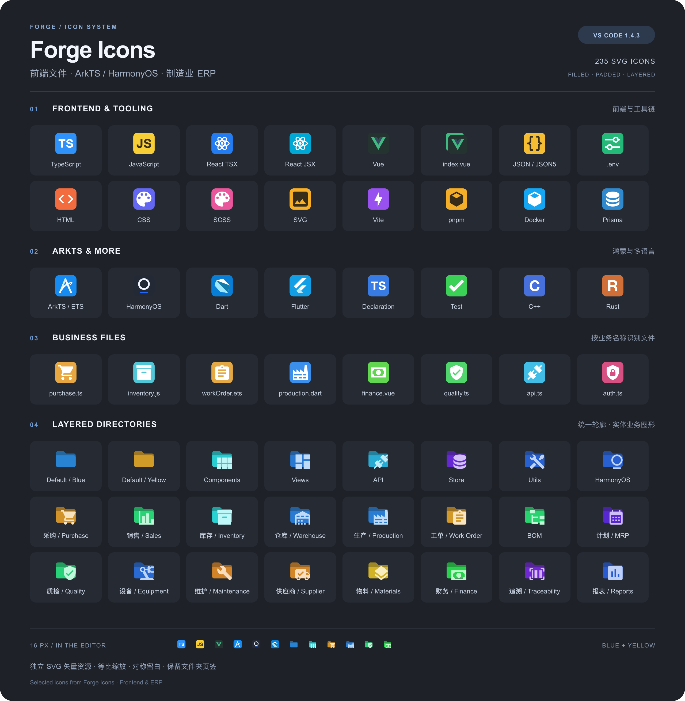

# Forge Icons · Frontend & ERP

> 为前端开发与制造业 ERP 项目制作的 VS Code 文件图标主题。圆角文件徽标、统一文件夹轮廓、Layered 叠层业务图形。

[](package.json)
[](https://code.visualstudio.com/)
[](LICENSE)
[](icons)
[](associations.json)

文件采用圆角徽标；所有目录保留统一的文件夹页签和外轮廓；业务图形以 Layered 叠层方式放在夹面右下方。未匹配业务名称的普通目录使用蓝色/黄色文件夹。TS/JS 等文字采用 Helvetica Neue Bold 的实心轮廓，统一字重和留白。全部图标采用独立 SVG 矢量路径，字体无需安装，主题不运行后台代码。

## 目录

- [预览](#预览)
- [特性](#特性)
- [安装](#安装)
- [图标覆盖范围](#图标覆盖范围)
- [匹配规则](#匹配规则)
- [设计规范](#设计规范)
- [本地开发](#本地开发)
- [更新日志](#更新日志)
- [设计参考](#设计参考)
- [许可](#许可)

## 预览



上图展示 1.4.3 的前端文件、ArkTS / HarmonyOS、业务文件和 Layered 业务目录；底部展示 16px 实际尺寸。预览图提供高清 PNG 和可缩放 SVG 两种格式。

在线预览全部图标（可搜索、切换 32px / 16px 与深浅背景）：

| 方式 | 链接 | 说明 |
| --- | --- | --- |
| 在线预览 | [打开预览页](https://weigu2700-cell.github.io/FrontEnd-icon/preview.html) | GitHub Pages，需先在仓库 Settings → Pages 启用 |
| 下载查看 | [下载 preview.html](https://raw.githubusercontent.com/weigu2700-cell/FrontEnd-icon/main/preview.html) | 单文件，下载后双击即可离线查看 |
| 源码浏览 | [在 GitHub 上查看](https://github.com/weigu2700-cell/FrontEnd-icon/blob/main/preview.html) | 直接查看 HTML 源码 |

> `preview.html` 是自包含的单文件，图标以行内 SVG 内嵌，无需联网或额外资源即可打开。

## 特性

- **圆角文件徽标** — 22.8×22.8 底块，统一 3.4 单位安全区，主体按可见边界等比居中。
- **统一文件夹轮廓** — 所有目录保留一致的页签与外轮廓，展开状态保留 VS Code 原生箭头。
- **Layered 业务图形** — 业务图形叠放在夹面右下方，保持原宽高比。
- **双配色主题** — 蓝色与黄色文件夹两套变体，深色/浅色编辑器共用同一套配色。
- **纯静态资源** — 全部为独立 SVG 矢量路径，字体已转曲，主题不运行任何后台代码。
- **零依赖构建** — 仅需 Python 3.9+，无需 npm 依赖。

## 安装

全程约 1 分钟，只需下载一个文件、点两次菜单。

### 第 1 步：下载安装包

点击下面的链接，浏览器会自动开始下载（约 208 KB）：

**➡️ [下载 forge-frontend-erp-icons-1.4.3.vsix](https://github.com/weigu2700-cell/FrontEnd-icon/releases/download/v1.4.3/forge-frontend-erp-icons-1.4.3.vsix)**

> 如果链接打不开，请到 [Releases 页面](https://github.com/weigu2700-cell/FrontEnd-icon/releases) 手动下载 `forge-frontend-erp-icons-1.4.3.vsix`。
> 下载后**不要解压**，`.vsix` 文件直接使用。

### 第 2 步：在 VS Code 中安装

1. 打开 VS Code。
2. 按 `⌘⇧X`（macOS）或 `Ctrl+Shift+X`（Windows / Linux）打开**扩展**面板。
3. 点击扩展面板右上角的 `…`（更多操作）按钮。
4. 在菜单中选择 **从 VSIX 安装…**（Install from VSIX…）。
5. 在弹出的文件选择框中找到刚下载的 `forge-frontend-erp-icons-1.4.3.vsix`，选中并确认。
6. 右下角出现「已完成安装」提示即表示成功。

> 找不到 `…` 按钮？也可以按 `⌘⇧P` / `Ctrl+Shift+P` 打开命令面板，输入 `Install from VSIX` 并回车，效果相同。

### 第 3 步：启用图标主题

1. 按 `⌘⇧P`（macOS）或 `Ctrl+Shift+P`（Windows / Linux）打开命令面板。
2. 输入 `文件图标主题`（或 `File Icon Theme`），选择 **首选项: 文件图标主题**。
3. 在列表中选择：
   - **Forge Icons · Blue Folders** — 蓝色文件夹，默认推荐
   - **Forge Icons · Yellow Folders** — 黄色文件夹

图标立即生效，无需重启。

### 常见问题

| 问题 | 解决办法 |
| --- | --- |
| 下载后是 `.zip` 或文件夹 | 不要解压。若浏览器自动解压，请重新下载并选择「保留原文件」 |
| 菜单里没有「从 VSIX 安装…」 | 用命令面板：`⌘⇧P` → 输入 `Install from VSIX` |
| 安装后图标没变化 | 确认已执行第 3 步选择主题；若仍无效，按 `⌘⇧P` → `Developer: Reload Window` 重载窗口 |
| 想换回原来的图标 | 重复第 3 步，在列表中选择原来的主题（如 **Material Icon Theme**）即可，无需卸载本主题 |
| 想手动改配置 | 在 `settings.json` 中设置 `"workbench.iconTheme": "forge-icons-blue"`（黄色为 `"forge-icons-yellow"`） |

> 工作区或配置文件中的同名设置会覆盖用户设置。若主题不生效，请检查当前工作区的 `.vscode/settings.json` 是否也设置了 `workbench.iconTheme`。

### 从源码构建（可选）

仅在需要自行修改图标时使用：

```bash
python3 scripts/package.py   # 在仓库上一级目录生成 forge-frontend-erp-icons-1.4.3.vsix
```

## 图标覆盖范围

| 分类 | 覆盖内容 |
| --- | --- |
| 前端 | TS / JS / JSX / TSX / Vue / JSON / JSONC / JSON5 / HTML / CSS / Sass / Less / SVG / 常见图片 |
| 环境 | `.env`、`.env.local`、`.env.production`、`.env.development.local` 等常见命名 |
| 工具链 | Vite、Vitest、Webpack、ESLint、Prettier、Tailwind、PostCSS、TypeScript 配置、npm / pnpm / Yarn / Bun、Git、Docker、Prisma、GraphQL、测试文件 |
| 跨端 | `.ets` / ArkTS、鸿蒙配置与包文件、Dart、Flutter 的 `pubspec.yaml` / `pubspec.lock` 与工具配置、uni-app 的 `.uvue` / `.uts` |
| 通用 | Markdown、YAML、SQL、XML、脚本、Python、Java、Kotlin、Swift、Go、Rust、C/C++/C#、压缩包、字体、音视频 |
| 常用目录 | 组件、页面、接口、服务、hooks、工具、状态、路由、资源、样式、类型、配置、测试、文档、脚本、依赖、权限、用户、报表、国际化等 |
| ERP | 采购、销售、库存、仓库、入库、出库、调拨、生产、BOM、MRP/MPS/APS、工单、工艺、质检、设备、维护、物料、产品、供应商、客户、财务、发票、物流、批次追溯、委外、报废、人事等常见名称 |

### 统计

| 项目 | 数量 |
| --- | --- |
| SVG 图标（含展开状态） | 235 |
| 扩展名映射 | 429 |
| 精确文件名映射 | 6544 |
| 目录名称映射 | 627 |
| 语言 ID 映射 | 46 |

完整清单见 [`associations.json`](associations.json)。

## 匹配规则

VS Code 文件图标主题按名称匹配，不读取业务代码：

- `purchase`、`purchaseOrder`、`purchase-order`、`purchase_order`、`采购` 等已预置别名会命中。
- 任意自定义前缀或缩写需要添加别名；不会读取文件内容推断业务，也不会把 `my-purchase-report.ts` 自动当成采购文件。
- 大小写不敏感；目录通配符与正则不受原生主题支持。
- `vendor` 默认表示依赖目录，供应商使用 `supplier` / `suppliers` / `供应商`。
- 显式业务名优先：`purchase.service.ts` 显示采购，通用 `session.service.ts` 显示服务。
- `index.vue` 优先显示入口；测试文件和 `.d.ts` 声明仍保留专用图标。
- Flutter 应用源文件仍使用 `.dart`，专属 Flutter 图标用于项目配置及相关目录。

## 设计规范

全部 SVG 使用 24×24 正方形画布：

- 文件夹外壳使用统一路径，业务图形按实际可见边界等比缩放，放入 16×15.5 个画布单位的前景区域。
- 不通过独立缩放 X/Y 改变宽高比；文件夹保持横向轮廓，文件徽标保持方形。
- 文件徽标为 22.8×22.8，字形等比放大 5%，通用图形采用实心填充路径。
- 统一使用 16×16 安全区和可见边界居中规则；Layered 文件夹前景图形距画布右边和下边各 1.5 单位。

## 本地开发

需要 Python 3.9+，不需要 npm 依赖。

```sh
python3 scripts/build.py             # 生成图标与主题 JSON
python3 scripts/validate.py          # 校验图标与映射
python3 scripts/check_proportions.py # 检查比例与安全区
python3 scripts/package.py           # 打包 VSIX
```

在 [`scripts/build.py`](scripts/build.py) 的 `FILES` / `FOLDERS` / `ROLE_SUFFIXES` 中修改图形、颜色或别名，再生成并重新安装 VSIX。修改生成后的主题 JSON 会被下一次构建覆盖。

[`scripts/lettering.json`](scripts/lettering.json) 保存已转曲字形；仅需更换字体或新增字形时，在 macOS 上运行 `swift scripts/export-lettering.swift scripts/lettering.json`。常规构建不依赖 Swift 或系统字体。

### 项目结构

```text
forge-icons/
├── icons/              # 235 个 SVG 图标
├── themes/             # 蓝色 / 黄色主题 JSON
├── scripts/            # 构建、校验、打包脚本
├── previewIcon/        # README 预览图
├── preview.html        # 自包含图标预览页
├── associations.json   # 完整映射清单
└── package.json        # 扩展清单
```

## 更新日志

### 1.4.3 — ArkTS / HarmonyOS 品牌图形同步

- ETS 使用华为 ArkTS 官网缎带 A 视觉的实心矢量适配图形，替换 ETS 字母。
- HarmonyOS 文件及对应目录使用官方字标的圆环与短横特征，替换 H 字母及旧芯片图形。
- 与 DevEco 版共用 `scripts/brand-art.json` 的路径、颜色和实测边界；保持 16×16 安全区、至少 3.4 单位内边距与等比缩放。
- 鸿蒙配置与 HAP / HAR / HSP 文件沿用原有匹配规则；蓝色、黄色主题同步更新。
- 图形为 IDE 小尺寸适配版，来源及品牌权利见第三方声明。


### 1.4.2 — 留白修正

所有文件徽标使用统一安全区：22.8×22.8 底块内预留四边至少 3.4 单位内边距，主体按实际可见边界等比居中在 16×16 区域。宽高不同的图形按长边适配，左右及上下各自对称，不拉伸填满；文字保留统一字重和字号上限。`index.vue` 前页采用相同的 3.4 内边距。Layered 文件夹的前景图形距画布右边和下边各 1.5 单位。

### 1.4.1 — 配色调整

Vue 和 `index.vue` 的浅薄荷底色改为低饱和深墨绿 `#24332F`，融入深色资源管理器；官方标志的颜色、尺寸和入口叠页结构保持不变。

### 1.4.0 — Layered 文件夹

- 文件夹采用 Layered：保留完整页签和前后夹面，业务图形在右下方叠层呈现。
- Vue 使用官方 `vuejs/art` 图形和 `#42B883` / `#35495E` 配色；`index.vue` 使用专属叠页入口样式。
- 新增 39 类业务文件图标，例如 `purchase.ts`、`inventory.js`、`workOrder.ets`、`production.dart`、`finance.vue`。
- 支持复合后缀：`*.api.ts`、`*.service.ts`、`*.store.ts`、`*.dto.ts`、`*.guard.ts`，以及对应 JS / ETS / Dart 等扩展。主题中登记的是 `service.ts` 这样的扩展名，不使用通配符。
- 显式业务名优先，例如 `purchase.service.ts` 显示采购；通用 `session.service.ts` 显示服务。`index.vue` 优先显示入口，测试文件和 `.d.ts` 声明仍保留专用图标。
- 通用图形改为填充路径，减少细线与边框依赖；品牌图形保留必要的标志结构。

## 设计参考

- [Material Icon Theme](https://marketplace.visualstudio.com/items?itemName=PKief.material-icon-theme)：语义颜色与业务目录标识。
- [vscode-icons](https://marketplace.visualstudio.com/items?itemName=vscode-icons-team.vscode-icons)：语言和工具链的识别覆盖。
- [File Icons](https://marketplace.visualstudio.com/items?itemName=file-icons.file-icons)：小尺寸下的文件类型区分。
- [VS Code 官方主题文档](https://code.visualstudio.com/api/extension-guides/file-icon-theme)：原生文件名、扩展名和目录匹配机制。

## 许可

本项目代码采用 [MIT 许可](LICENSE)。1.4.0 的业务目录轮廓采用 [Material Design Icons](https://github.com/Templarian/MaterialDesign-SVG)（`@mdi/svg` 7.4.47）的完整矢量路径，授权见 [`THIRD-PARTY-NOTICES.txt`](THIRD-PARTY-NOTICES.txt) 与 [`LICENSE-APACHE-2.0.txt`](LICENSE-APACHE-2.0.txt)。

文件图标和普通文件夹依据用户参考绘制；文件及目录图形来源清单见 [`scripts/folder-art.json`](scripts/folder-art.json) 和 [`scripts/solid-art.json`](scripts/solid-art.json)。技术名称及识别符号归其各自权利人所有；这是本地自用主题，没有发布到 Marketplace。
